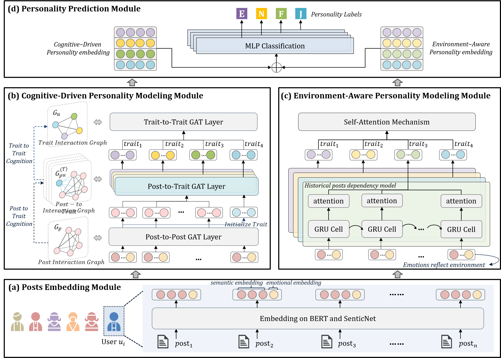

# TypeDetective

## Overview

TypeDetective is an interpretable personality detection model on social media driven by Type Dynamics Theory. The framework of TypeDetective is depicted in Figure 1, illustrated using an example of the ENFP personality.
<div align=center>
    
</div>
<div align=center>
Figure 1: The framework of TypeDetective.
</div>


## Dataset
We evaluate our method on the [Kaggle](https://www.kaggle.com/datasnaek/mbti-type) and [Pandora](https://psy.takelab.fer.hr/datasets/all) datasets.


## Quick Start

**Step1: Installation for tools**

```python
# python 3.8
pip install -r requirements.txt
```

**Step2: Write a configuration file in yaml format**
Users can easily configure the parameters of TypeDetective in a yaml file. The path of the configuration file is ./config/config.yaml

```yaml
deepseek:
  api_key: # your_deepseek_API_key
  base_url: https://api.deepseek.com
  temperature: 0.2
  max_tokens: 2048
prompts:
  llm_prompt: config/prompts.yaml
```

**Step3: Run with the code**
```python
python src/main.py
```

## Citation
Please cite our repository if you use TypeDetective in your work.
```bibtex

```
